# Lab 01 — MongoDB: Các thao tác CRUD

## Môi trường và công cụ
- MongoDB Atlas: dịch vụ cơ sở dữ liệu đám mây để tạo cluster và nạp dữ liệu mẫu.
- MongoDB Compass / mongosh: giao diện GUI và shell để kết nối và thực hiện truy vấn.

## Bài 1 — Thiết lập môi trường

### 1.1 Đăng ký MongoDB Atlas và tạo cluster miễn phí

1. Đăng ký hoặc đăng nhập (Google/GitHub).
2. Tạo cluster mới (chọn cấu hình miễn phí nếu cần).

Giao diện tạo cluster:
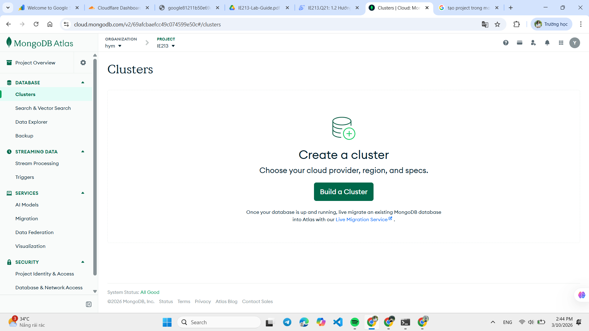
Tùy chỉnh cluster:
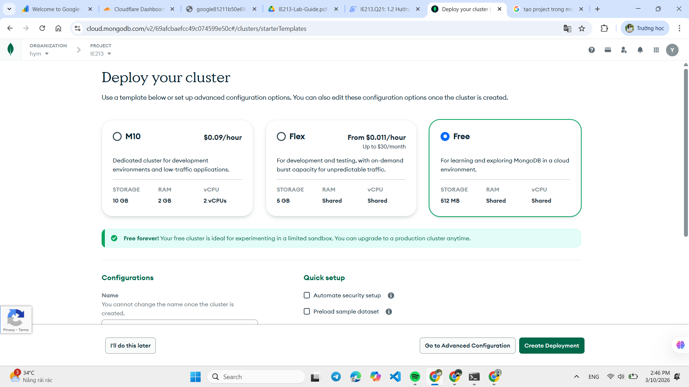

Lưu ý: Các tuỳ chọn "Automate security setup" và "Preload sample dataset" thường được chọn mặc định; để thực hành từng bước, hãy bỏ chọn nếu bạn muốn nạp dữ liệu mẫu sau.

Nhấn "Create Deployment" để khởi tạo cluster.

### 1.2 Nạp dữ liệu mẫu vào cluster

Sau khi cluster sẵn sàng, dùng nút "Load Sample Data" để thêm sample datasets vào cluster:
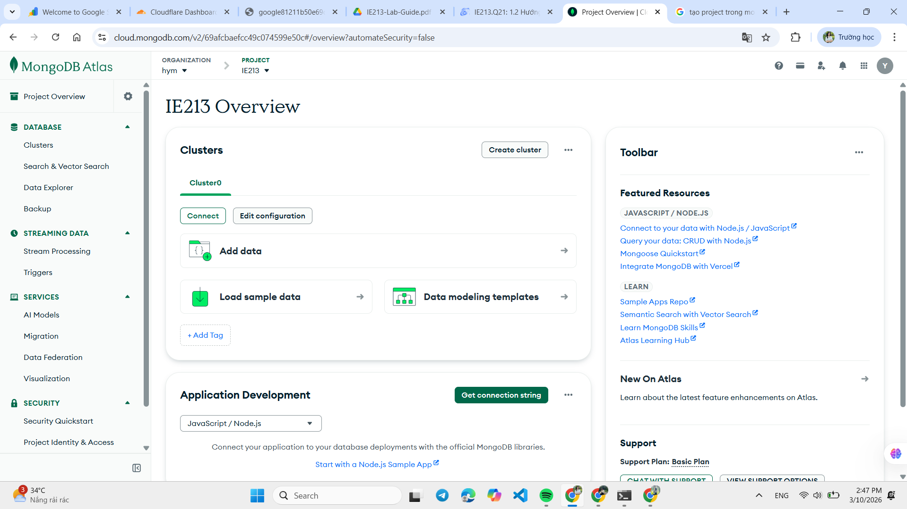
Nhấn "Load sample data" để thực hiện:
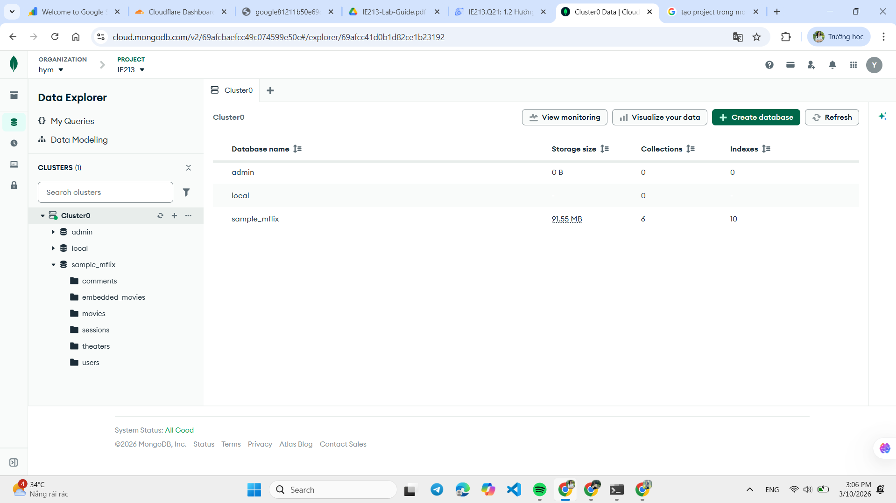

### 1.3 Cài đặt MongoDB Compass

Tải và cài đặt MongoDB Compass nếu chưa có:
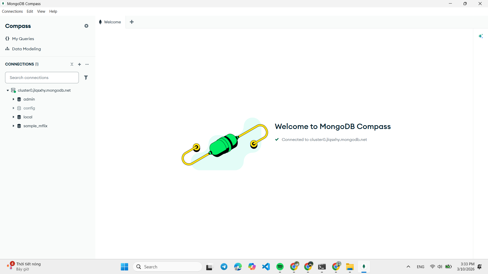

### 1.4 Kết nối MongoDB Compass với cluster

Trước khi kết nối, cần thực hiện 2 bước trong MongoDB Atlas (Security Quickstart):

- Tạo database user (username + password). Có thể dùng "Autogenerate Secure Password" và lưu lại password.
- Thêm IP vào IP Access List (thêm IP hiện tại hoặc tạm thời đặt 0.0.0.0/0 nếu mạng hạn chế).

Giao diện tạo user:
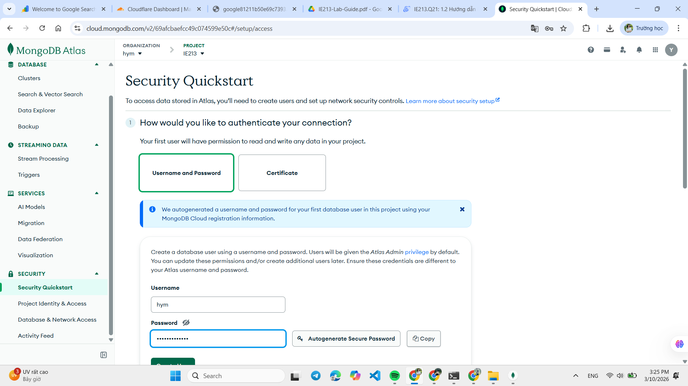

Sau khi cấu hình xong, vào Cluster → Connect → chọn Compass, copy chuỗi kết nối và dán vào "Add new connection" trong MongoDB Compass. Thay thế <db_password> bằng mật khẩu đã tạo, rồi chọn "Save & Connect":
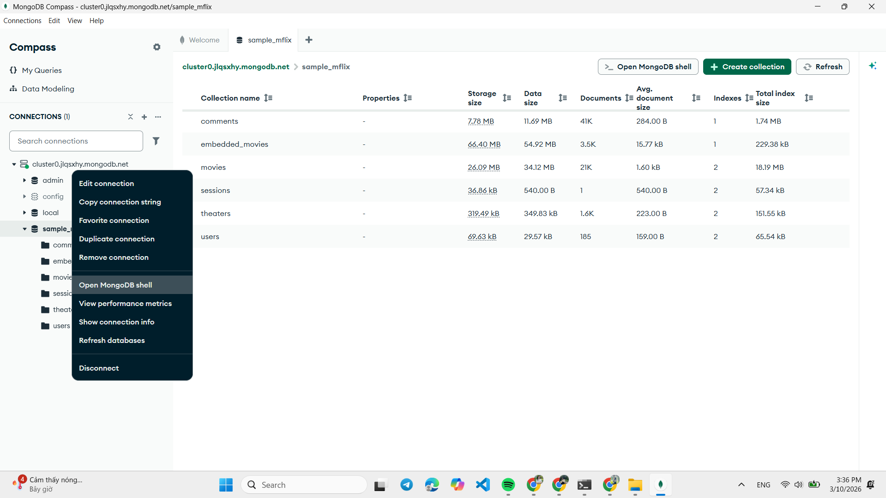

## Bài 2 — Sử dụng mongosh (MongoDB Shell)

### 2.1 Tạo cơ sở dữ liệu `23521849-IE213`

Mở MongoDB Shell từ Atlas (Open MongoDB Shell) và chạy:
```
use 23521849-IE213
```
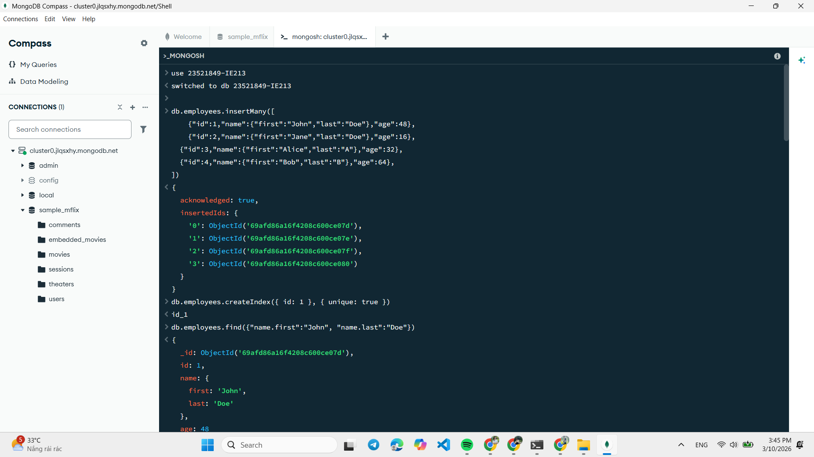

### 2.2 Thêm các document vào collection `employees`

Thêm cùng lúc nhiều document bằng `insertMany`:
```
db.employees.insertMany([
  {"id":1,"name":{"first":"John","last":"Doe"},"age":48},
  {"id":2,"name":{"first":"Jane","last":"Doe"},"age":16},
  {"id":3,"name":{"first":"Alice","last":"A"},"age":32},
  {"id":4,"name":{"first":"Bob","last":"B"},"age":64}
])
```


### 2.3 Đặt `id` là duy nhất

Tạo index với ràng buộc duy nhất:
```
db.employees.createIndex({ id: 1 }, { unique: true })
```
Khi đó không thể chèn document có `id` trùng.
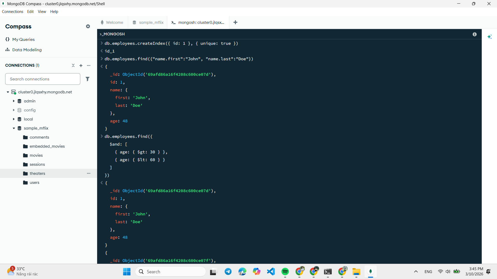

### 2.4 Tìm document với firstname = John và lastname = Doe

```
db.employees.find({ "name.first": "John", "name.last": "Doe" })
```


### 2.5 Tìm người có tuổi > 30 và < 60

```
db.employees.find({
  $and: [ { age: { $gt: 30 } }, { age: { $lt: 60 } } ]
})
```
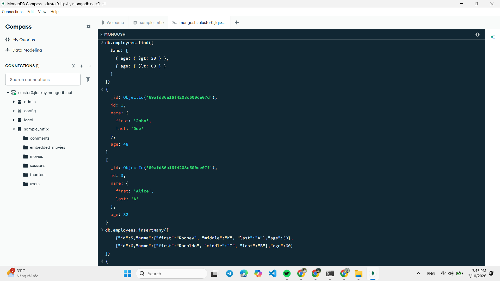

### 2.6 Thêm document có `middle` name và tìm những document có `middle`

Chèn dữ liệu:
```
db.employees.insertMany([
  {"id":5,"name":{"first":"Rooney","middle":"K","last":"A"},"age":30},
  {"id":6,"name":{"first":"Ronaldo","middle":"T","last":"B"},"age":60}
])
```

Tìm document có `middle` name:
```
db.employees.find({ "name.middle": { $exists: true } })
```
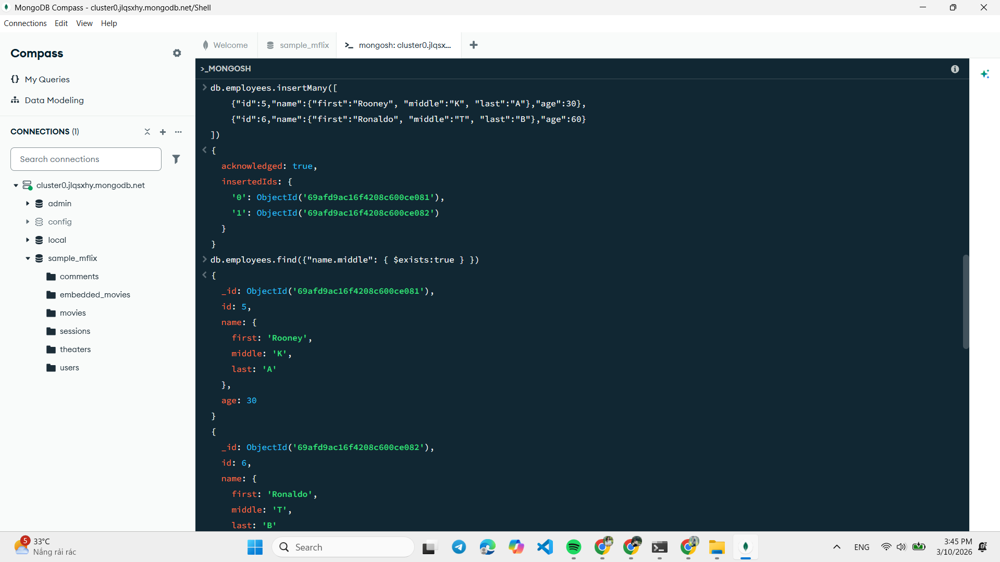
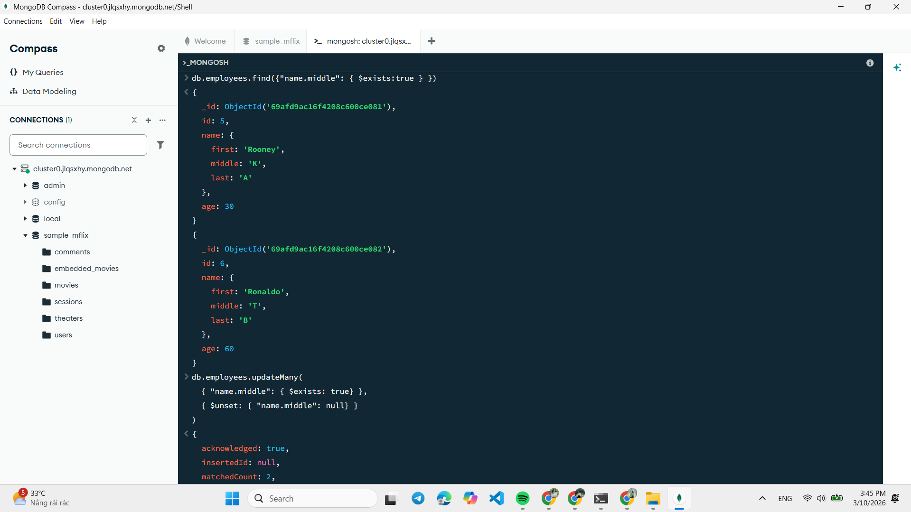

### 2.7 Xóa trường `middle` nếu không hợp lệ

```
db.employees.updateMany(
  { "name.middle": { $exists: true } },
  { $unset: { "name.middle": "" } }
)
```
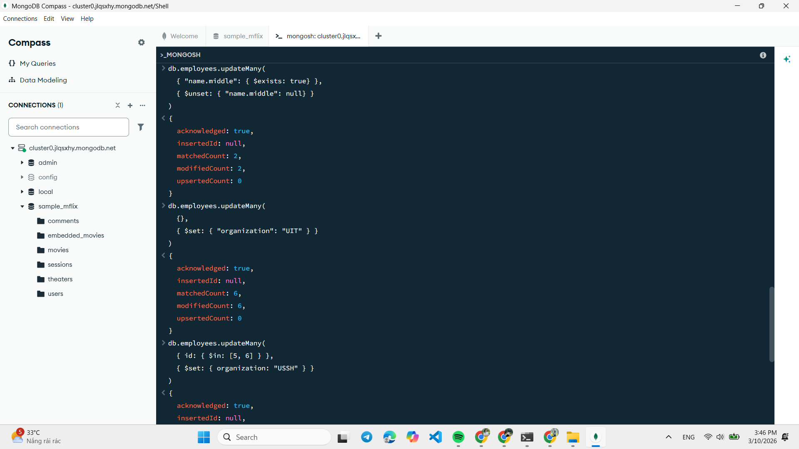

### 2.8 Thêm trường `organization: "UIT"` cho tất cả document

```
db.employees.updateMany({}, { $set: { organization: "UIT" } })
```
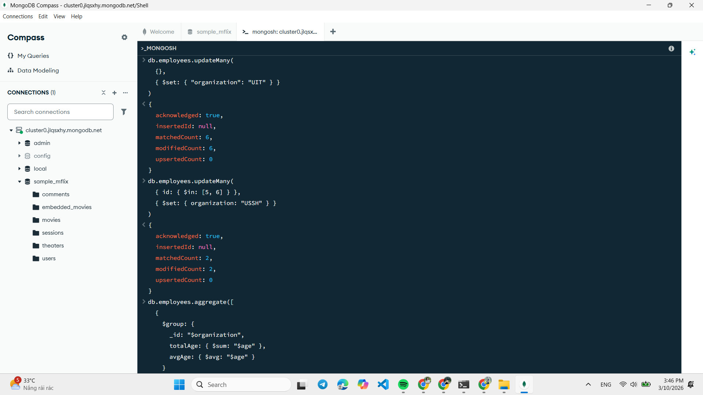

### 2.9 Cập nhật `organization` của id 5 và 6 thành "USSH"

```
db.employees.updateMany(
  { id: { $in: [5, 6] } },
  { $set: { organization: "USSH" } }
)
```
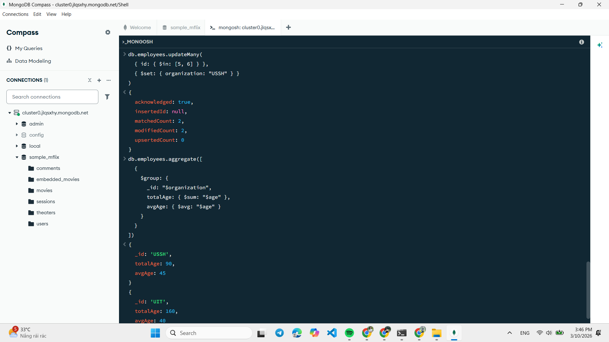

### 2.10 Tính tổng tuổi và tuổi trung bình theo `organization`

Sử dụng aggregation để nhóm theo `organization`:
```
db.employees.aggregate([
  {
    $group: {
      _id: "$organization",
      totalAge: { $sum: "$age" },
      avgAge: { $avg: "$age" }
    }
  }
])
```
Giải thích ngắn:
- `_id: "$organization"`: nhóm theo giá trị `organization`.
- `totalAge`: tổng các trường `age` trong mỗi nhóm.
- `avgAge`: tuổi trung bình trong mỗi nhóm.

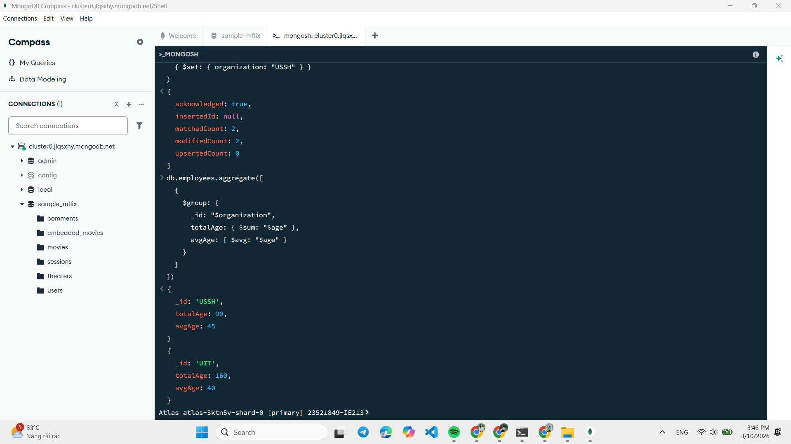

---