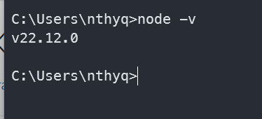
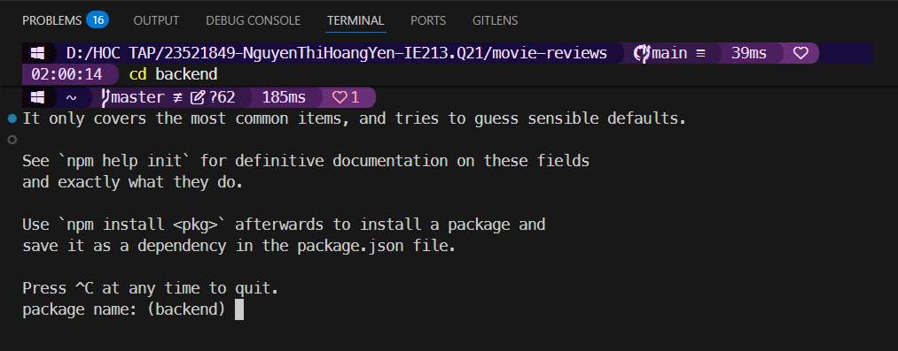
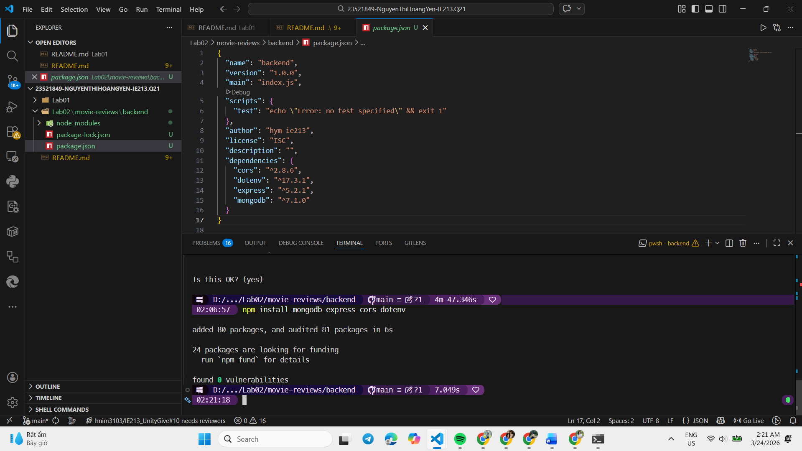
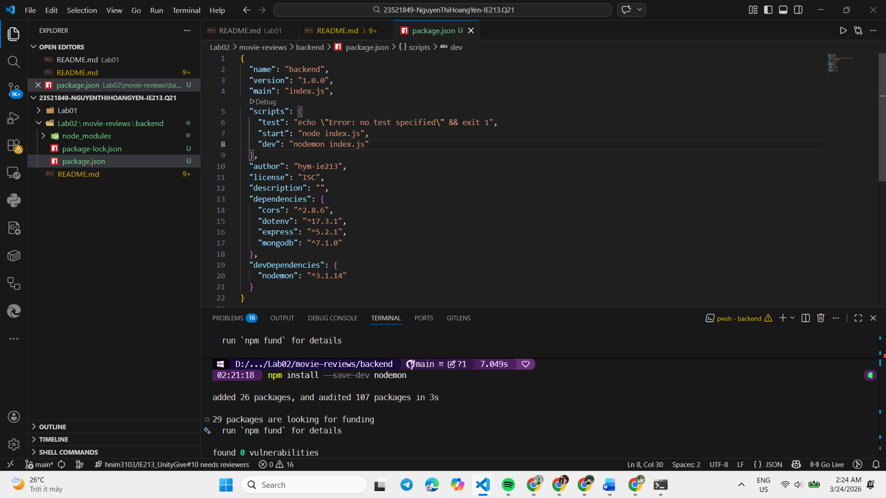
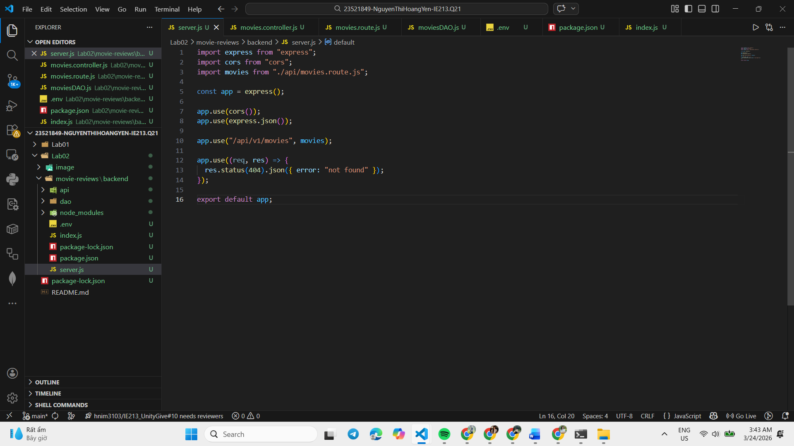
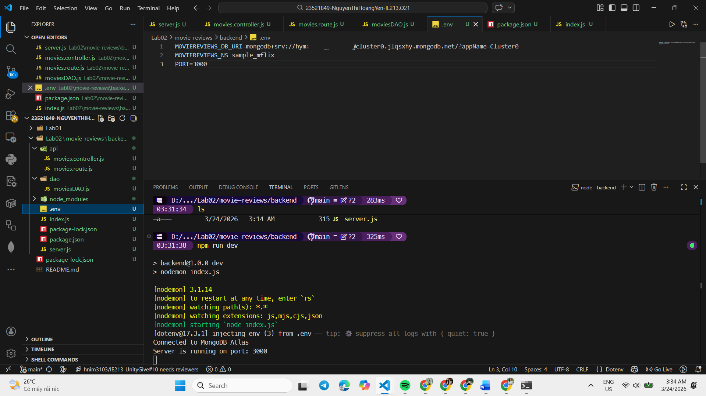
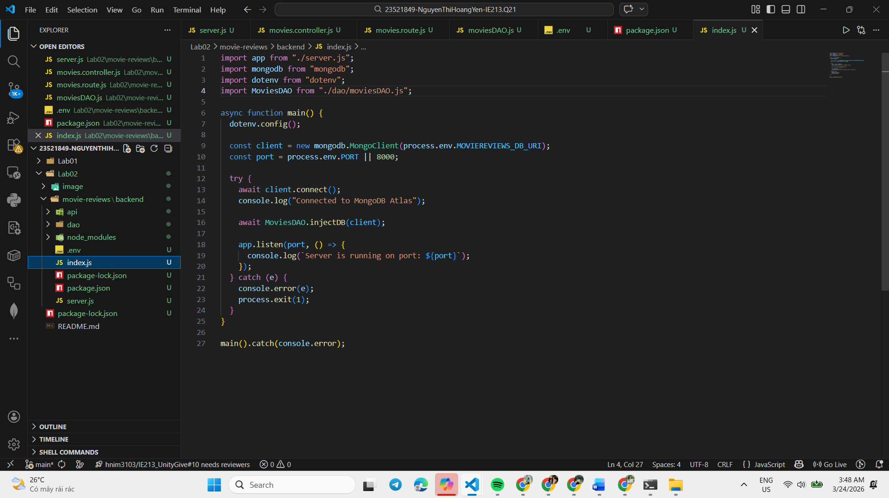
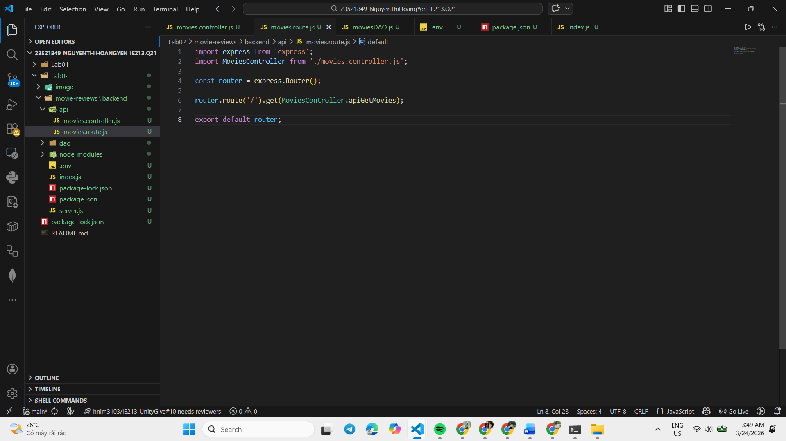
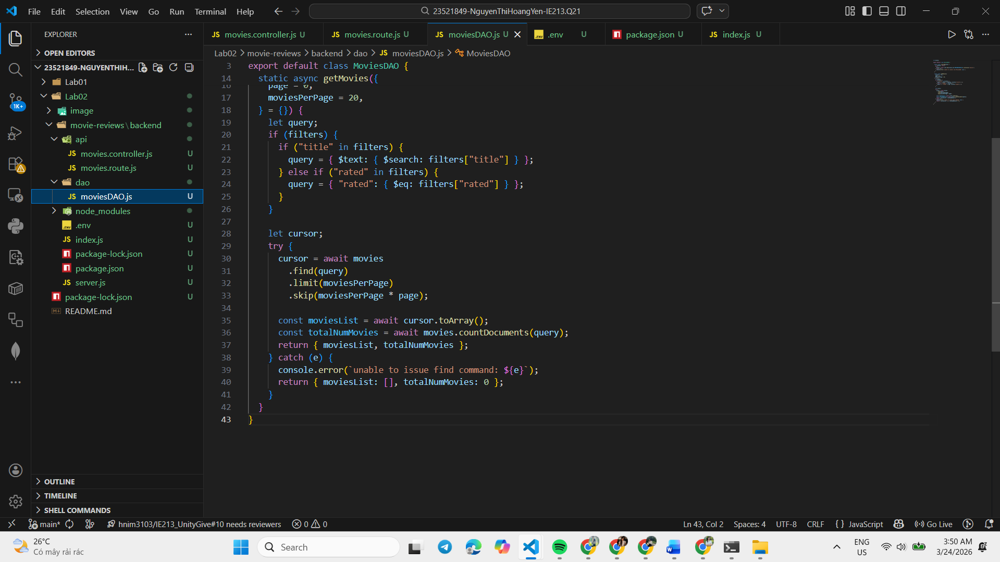
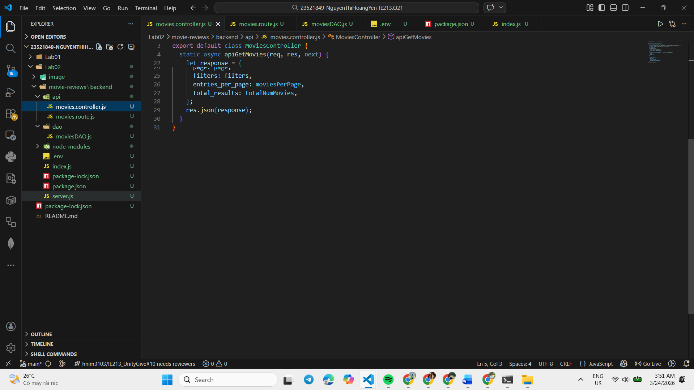

# Lab 02 — Thiết lập BACKEND với NODE.JS và EXPRESS.JS

## Mô tả bài tập
- Xây dựng backend đơn giản cho ứng dụng quản lý phim và đánh giá (movie-reviews). Backend cung cấp API để lấy, thêm, sửa, xóa phim và lưu trữ dữ liệu bằng cơ chế DAO.

## Cấu trúc thư mục chính (Lab02/movie-reviews/backend)
- `index.js`: Điểm khởi động ứng dụng (khởi tạo Express, kết nối middleware, đăng ký route).
- `server.js`: Khởi tạo.
- `package.json`: Khai báo dependencies và scripts (`start`, `dev`).
- `api/`:
	- `movies.route.js`: Định nghĩa các route liên quan đến movies.
	- `movies.controller.js`: Xử lý logic nghiệp vụ, gọi DAO để thao tác dữ liệu.
- `dao/`:
	- `moviesDAO.js`: Lớp/đối tượng truy xuất dữ liệu (CRUD) — tách việc truy xuất DB khỏi controller.

## Hướng dẫn chạy (tại `Lab02/movie-reviews/backend`)
1. Cài đặt dependencies:

```powershell
npm install
```

2. Tạo file cấu hình môi trường `.env` và khởi chạy server:

```powershell
npm run dev  
```

3. Mở trình duyệt hoặc dùng Postman để gọi API trên cổng hiển thị trong console (mặc định thường là 3000).

## API chính (ví dụ)
- `GET /api/movies` — Lấy danh sách phim.
- `GET /api/movies/:id` — Lấy chi tiết phim theo id.
- `POST /api/movies` — Thêm phim mới (body chứa thông tin phim).
- `PUT /api/movies/:id` — Cập nhật phim.
- `DELETE /api/movies/:id` — Xóa phim.

Ghi chú: Đường dẫn thực tế có thể khác tùy theo định nghĩa trong `movies.route.js`.

## Giải thích các thành phần chính
- `moviesDAO.js`: Chứa các hàm truy vấn (ví dụ: `getAll`, `getById`, `create`, `update`, `delete`). DAO chịu trách nhiệm kết nối với nguồn dữ liệu (MongoDB).
- `movies.controller.js`: Nhận request từ route, gọi DAO, xử lý lỗi và trả response phù hợp (status code, body).
- `movies.route.js`: Đăng ký đường dẫn và ánh xạ tới hàm controller tương ứng.
- `index.js`/`server.js`: Khởi tạo Express app, bật middleware (JSON parsing, CORS).

## Kinh nghiệm sau khi hoàn thành bài thực hành
- Tách rõ phần route/controller/dao giúp dễ bảo trì và test.
- Kiểm tra kỹ body request khi thêm/sửa để tránh lỗi null/undefined.
- Sử dụng `nodemon` trong quá trình phát triển để tự động reload server khi thay đổi mã nguồn.

---
# Minh chứng thực hiện

## Môi trường và công cụ
- Node.js: Môi trường thực thi JavaScript.
- Code Editor: Visual Studio Code.
- Dependencies: Express, MongoDB Driver, Cors, Dotenv, Nodemon.

## Bài 1 — Thiết lập môi trường

### 1.1 Tải và cài đặt nodejs

- Sử dụng terminal để kiểm tra phiên bản Node.js đã cài đặt:

Giao diện tạo cluster:


Kết quả dự kiến: v22.12.0.

### 1.2 Cài đặt công cụ soạn thảo và quản lý mã nguồn

- Sử dụng công cụ Visual Studio Code có sẵn.

### 1.3 Khởi tạo cây thư mục chứa mã nguồn dự án

- Khởi tạo cây thư mục:
23521849-NguyenThiHoangYen-IE213.Q21/
│
├── Lab01
├── Lab02
├──├── movie-reviews
├──├──├── backend
└── README.md

### 1.4 Khởi tạo dự án với câu lệnh npm int

Giao diện teminal sau khi thực hiện câu lệnh

.png)

### 1.5 Cài đặt một số dependency

Giao diện teminal sau khi thực hiện câu lệnh
\

### 1.6 Cài đặt nodemon

Giao diện teminal sau khi thực hiện câu lệnh và đoạn mã nguồn được thêm vào


## Bài 2 — Khởi tạo cấu trúc thư mục

### 2.1 Tạo tệp tin server.js



### 2.2 Tạo tệp tin .env



### 2.3 Tạo tệp tin index.js



### 2.4 Tạo thư mục api và tệp tin movies.route.js để xử lý định tuyến liên quan



### 2.5 Thiết lập công cụ truy xuất dữ liệu cho ứng dụng Movies với DAO



### 2.6 Thiết lập Controller



### 2.7 Đưa controller vào định tuyến

.png)

---