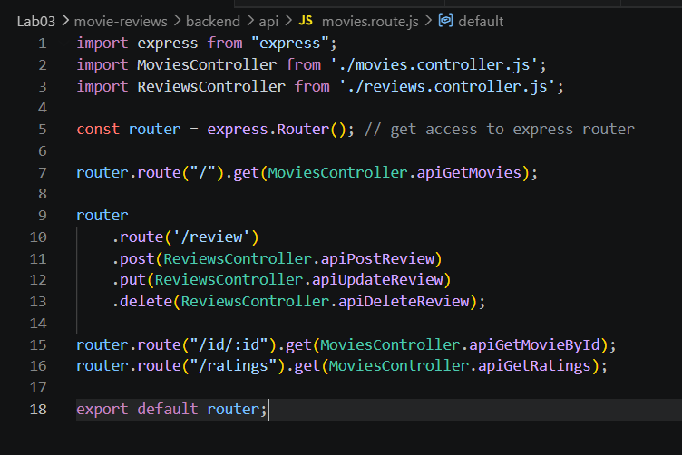
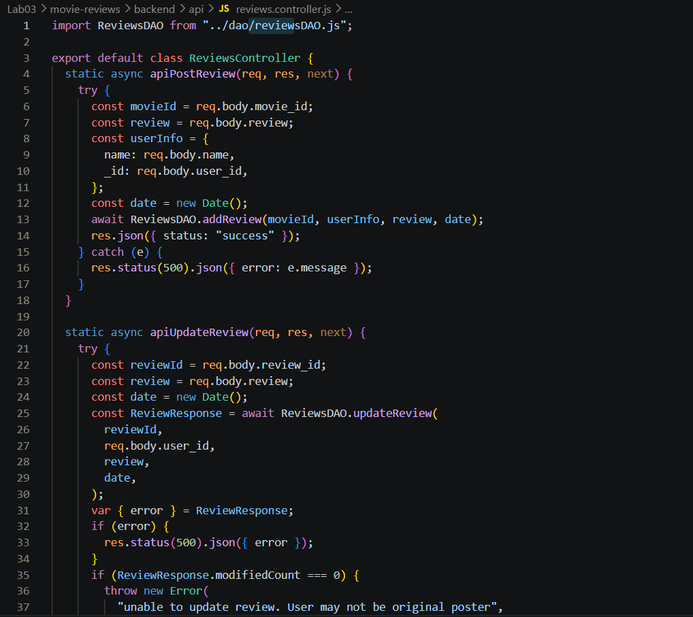
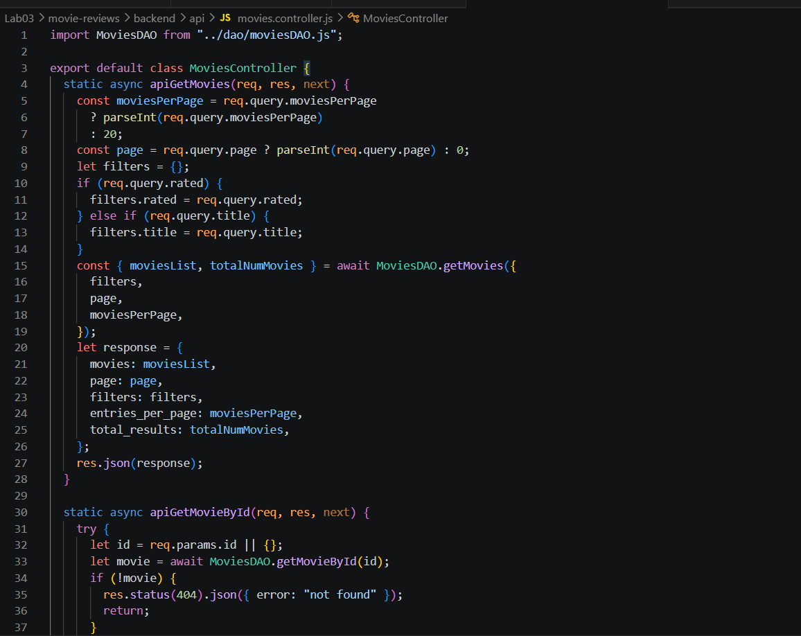
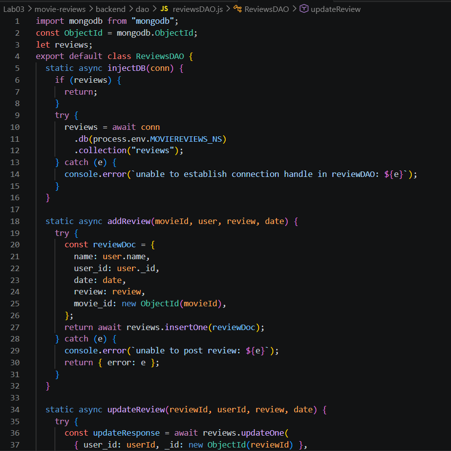
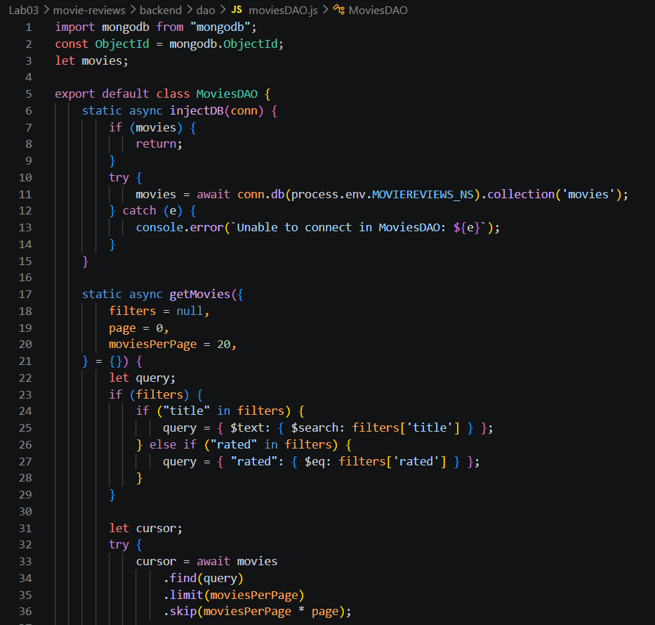
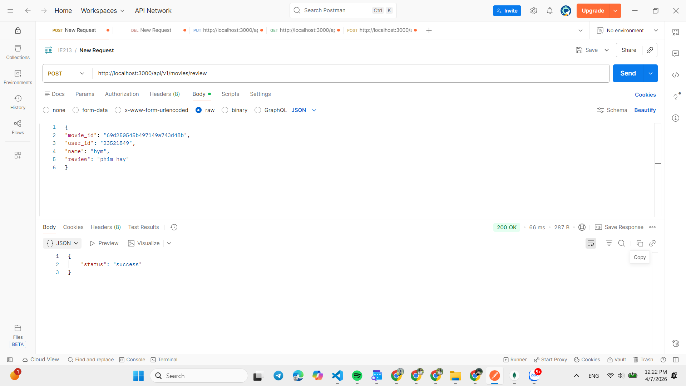
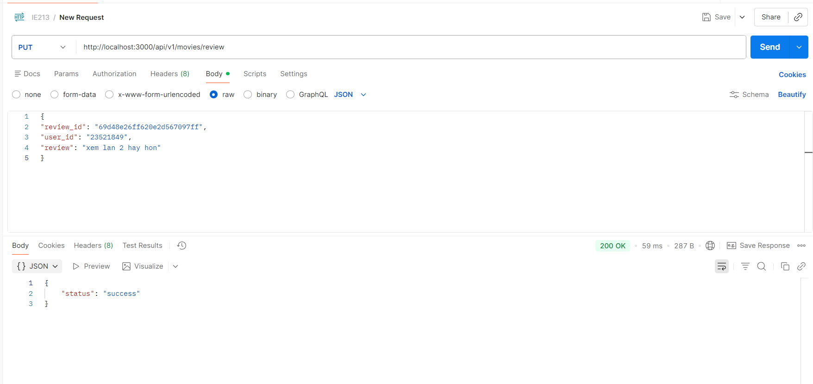
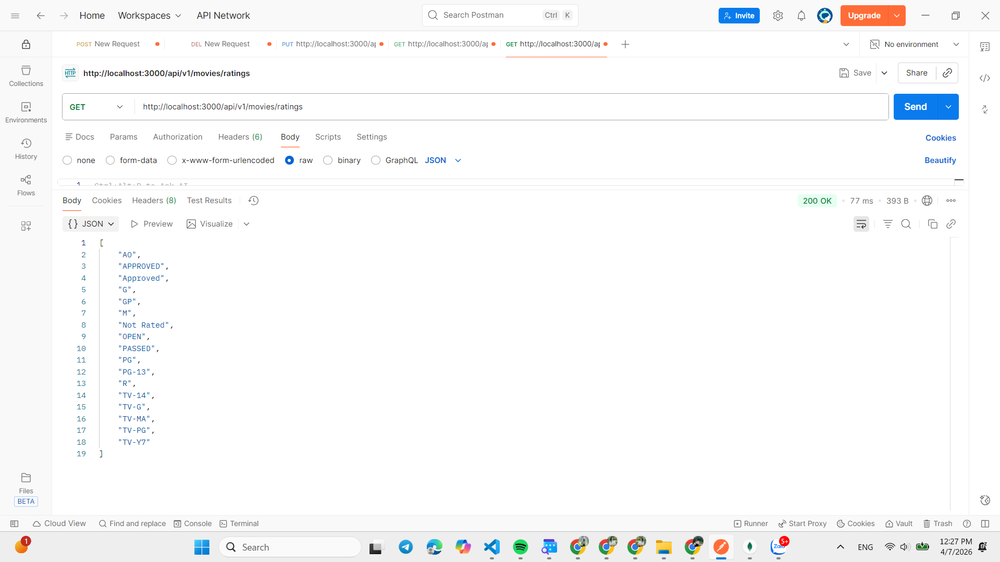
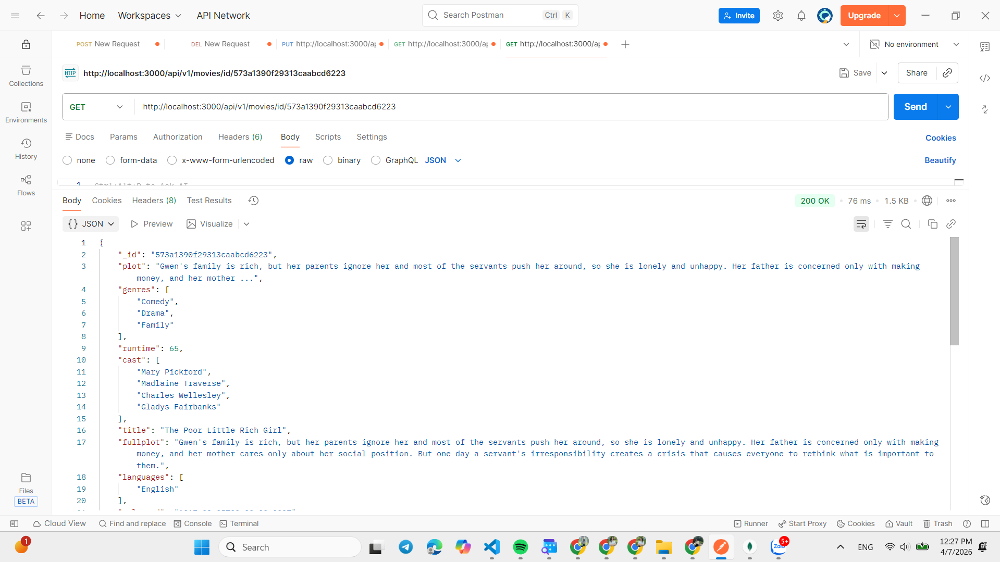

# Lab 03 — Hoàn Thiện BACKEND (Review, Movie ID, Ratings)

## Mô tả
- Bài Lab 03 tập trung vào hoàn thiện backend cho phần Review của ứng dụng movie-reviews: định tuyến (routing), controller, và DAO kết nối MongoDB.

## Cấu trúc thư mục chính (Lab03/movie-reviews/backend)
- `index.js`: kết nối MongoDB, inject DAO, start server.
- `server.js`: Khởi tạo Express app, bật middleware (CORS, JSON parser) và đăng ký route.
- `package.json`: Khai báo dependencies và scripts (`start`, `dev`).
- `api/`:
  - `movies.route.js`: Định nghĩa các route liên quan đến movies/reviews.
  - `reviews.controller.js`: Xử lý logic các endpoint review (POST, PUT, DELETE).
  - `movies.controller.js`: Xử lý các endpoint lấy phim/ratings.
- `dao/`:
  - `reviewsDAO.js`: Thao tác trực tiếp với collection `reviews` (insertOne, updateOne, deleteOne).
  - `moviesDAO.js`: Truy vấn collection `movies` (getMovies, getMovieById, getRatings).

## Hướng dẫn chạy chương trình (tại `Lab03/movie-reviews/backend`)
1. Cài đặt dependencies:

```terminal
npm install
```

2. Tạo file cấu hình môi trường `.env` với các biến `MOVIEREVIEWS_DB_URI`, `MOVIEREVIEWS_NS`, `PORT`.

3. Khởi chạy server:

```terminal
npm start
```

4. Server mặc định lắng nghe cổng trong `.env` (mặc định 3000). Sử dụng Postman để gọi API.

## API chính (tương tự Lab02 nhưng tập trung Review)
- `POST /api/v1/movies/review` — Thêm review mới. Body JSON cần: `movie_id`, `user_id`, `name`, `review`.
- `PUT /api/v1/movies/review` — Cập nhật review. Body JSON cần: `review_id`, `user_id`, `review`.
- `DELETE /api/v1/movies/review` — Xóa review. Body JSON cần: `review_id`, `user_id`.
- `GET /api/v1/movies/id/:id` — Lấy chi tiết phim theo id (kèm reviews qua `$lookup`).
- `GET /api/v1/movies/ratings` — Lấy danh sách các ratings (distinct `rated`).

Ghi chú: Đảm bảo `Content-Type: application/json` khi gửi body.

## Giải thích các thành phần chính
- `reviewsDAO.js`: Thao tác trực tiếp với MongoDB collection `reviews`. Hàm chính: `addReview(movieId, user, review, date)`, `updateReview(reviewId, userId, review, date)`, `deleteReview(reviewId, userId)`.
- `moviesDAO.js`: Hàm `getMovieById(id)` dùng `aggregate` + `$lookup` để ghép reviews; `getRatings()` dùng `distinct("rated")`.
- `reviews.controller.js`: Nhận request từ route, validate dữ liệu, gọi DAO, và trả về `{ status: "success" }` hoặc lỗi phù hợp.
- `movies.route.js`: Đăng ký các route `/api/v1/movies` và `/api/v1/movies/review`.

---

## Kinh nghiệm sau khi hoàn thành bài thực hành

- Kiểm thử theo luồng: POST → kiểm tra DB → PUT → kiểm tra → DELETE → kiểm tra. Dùng Postman hoặc script tự động (`run_api_review_tests.js`).
- Luôn đặt header `Content-Type: application/json` và gửi body JSON hợp lệ.
- `review_id` phải là ObjectId hợp lệ (24 hex chars); trong DAO hãy dùng `new ObjectId(id)` khi cần chuyển kiểu.
- `user_id` phải khớp với trường lưu trong document để được phép sửa/xóa — kiểm tra kỹ giá trị `user_id` (ví dụ dùng MSSV khi test).
- Trả về thông báo lỗi rõ ràng: serialize `Error.message` trước khi gửi, tránh trả trực tiếp `Error` (JSON sẽ thành `{}`).
- Khi debug, bật logging cho request body, DAO response và bất kỳ lỗi nào trên server (xem console nơi chạy `npm start`).
- Tạo data test riêng (không dùng dữ liệu thực) và xóa sau test để tránh ảnh hưởng DB thật.
- Dùng `nodemon` khi phát triển để tự động reload; viết script kiểm thử (như `run_api_review_tests.js`) để lặp lại kiểm tra nhanh.


---
# Minh chứng thực hiện

## Môi trường và công cụ
- Node.js: Môi trường thực thi JavaScript.
- Code Editor: Visual Studio Code.
- Dependencies: Express, MongoDB Driver, Cors, Dotenv, Nodemon.
- Kiểm thử: Postman

## Bài 1 — Thiết lập định tuyến cho các thao tác tới review

### Cấu hình trong tệp movies.router.js các đường dẫn cho thao tác review và thông tin phim.

- Đường dẫn review: /api/v1/movies/review hỗ trợ các phương thức POST, PUT, DELETE.

	Đường dẫn thông tin:
	+ Lấy phim theo ID: /api/v1/movies/id/:id.
	+ Lấy danh sách Ratings: /api/v1/movies/ratings
	


## Bài 2 - Thiết lập Controller

### Cấu hình trong tệp movies.router.js các đường dẫn cho thao tác review và thông tin phim.

- Quản lý các yêu cầu từ máy khách thông qua các tệp controller.

	Reviews Controller (reviews.controller.js)
	+ apiPostReview: Lấy movie_id, review, name, user_id để thêm review mới.
	+ apiUpdateReview: Cập nhật nội dung review (yêu cầu đúng user_id).
	+ apiDeleteReview: Xóa review dựa trên review_id và user_id.



	Movies Controller (movies.controller.js)
	+ apiGetMovieById: Lấy chi tiết một bộ phim kèm các review liên quan.
	+ apiGetRatings: Lấy tất cả các loại phân loại (ratings) hiện có.



## Bài 3 - Thiết lập Data Access Object (DAO)

### Tương tác trực tiếp với cơ sở dữ liệu MongoDB.
- Reviews DAO (reviewsDAO.js)
	+ Sử dụng insertOne(), updateOne(), và deleteOne() để thao tác với collection reviews.



- Movies DAO (moviesDAO.js)
	+ getMovieById: Sử dụng aggregate với $match và $lookup để gộp thông tin phim và reviews.
	+ getRatings: Sử dụng distinct("rated") để lấy danh sách các loại rating.



### Thử nghiệm API

- POST



- PUT



- DELETE


## Bài 4 - Hoàn thành backend

### Thử nghiệm API

- getRatings



- getMovieById


---