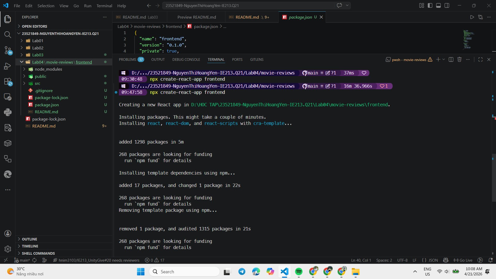
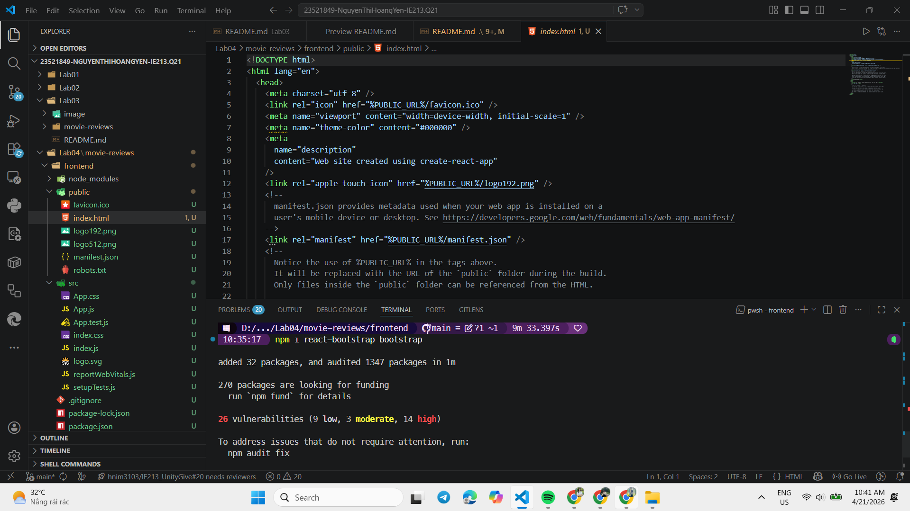
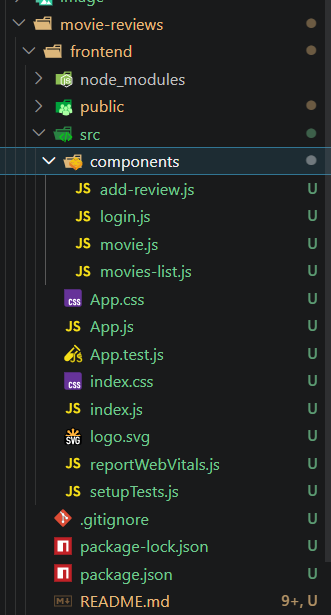
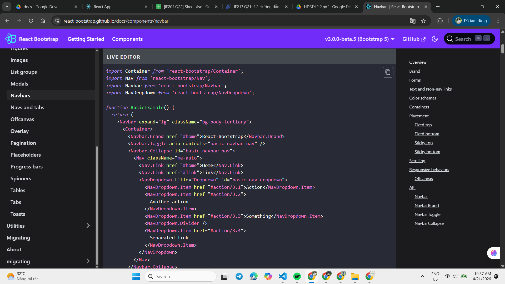
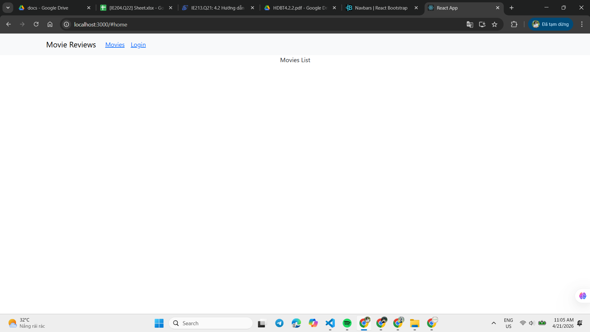
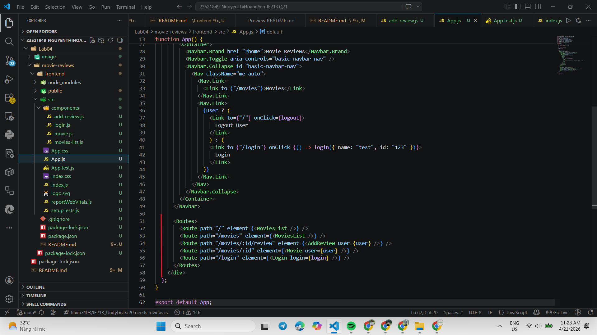

# LAB04 – Thiết lập Frontend với ReactJS

---
## Thông tin sinh viên
- Họ tên: Nguyễn Thị Hoàng Yến
- MSSV: 23521849
- Môn học: IE213.Q21 – Kỹ thuật phát triển hệ thống Web

## Mô tả bài tập
- Xây dựng phần frontend cho ứng dụng Movie Reviews bằng ReactJS.
- Yêu cầu: tạo giao diện hiển thị danh sách phim, trang chi tiết phim (kèm review), chức năng thêm review và trang đăng nhập, sử dụng React Router để định tuyến và React-Bootstrap để xây dựng Navbar.

## Cấu trúc thư mục chính (Lab04/movie-reviews/frontend)
- `package.json`: khai báo dependencies và scripts (`start`, `build`).
- `public/`: chứa `index.html`, `manifest.json`, hình ảnh tĩnh.
- `src/App.js`: entry component, cấu hình `Routes` và `Navbar`.
- `src/index.js`: khởi tạo React app.
- `src/components/`:
	- `movies-list.js` — component hiển thị danh sách phim.
	- `movie.js` — component hiển thị chi tiết phim và reviews.
	- `add-review.js` — form thêm review cho phim.
	- `login.js` — trang đăng nhập/đăng xuất.

## Công cụ & thư viện
- Node.js, npm
- React (create-react-app)
- react-router-dom (định tuyến)
- react-bootstrap, bootstrap (giao diện)
- Visual Studio Code

## Hướng dẫn cài đặt và chạy
1. Mở terminal tại thư mục dự án frontend:

```powershell
cd Lab04/movie-reviews/frontend
```

Chạy ứng dụng với câu lệnh:
```bash
cd frontend
npm start
```

**Kết quả**



.png)

#### 1.2 Cài đặt một số package hỗ trợ xây dựng dự án

Cài đặt Bootstrap hỗ trợ xây dựng UI
```bash
npm i react-bootstrap bootstrap

```
Cài đặt React router dom hỗ trợ định tuyến.
```bash
npm i react-router-dom
```

**Kết quả**



.png)

---

### Bài 2: Xây dựng Navigation Header bar cho ứng dụng

#### 2.1 Xây dựng các components

Tạo thư mục `components` trong `src/` và tạo các file component:
- `movies-list.js`: hiển thị thông tin danh sách phim
- `movie.js`: hiển thị phim với các review
- `add-review.js`: hỗ trợ thêm review cho khách
- `login.js`: trang đăng nhập cho khách

**Kết quả**



#### 2.2 Lấy Navbar Component từ React-Bootstrap

Lấy Navbar Component từ https://react-bootstrap.github.io/docs/components/navbar/ và đưa vào trong phần mã nguồn JSX của function `App()` trong tệp tin `App.js`.

**Kết quả**



#### 2.3 Điều chỉnh thông tin

Điều chỉnh các thông tin sau:
- Tên logo: **Movie Reviews**
- Liên kết thứ nhất: thay `Home` thành `Movies`
- Liên kết thứ hai: thay `Link` thành trạng thái `Login/Logout` của người dùng

Sử dụng React hook `useState` để lưu giữ và thay đổi trạng thái đăng nhập:
```javascript
const [user, setUser] = React.useState(null);
```

**Kết quả**

Trạng thái chưa đăng nhập (hiển thị Login):



Trạng thái đã đăng nhập (hiển thị Logout User):

.png)

---

### Bài 3: Thiết lập các định tuyến cho các component

#### 3.1 Sử dụng thẻ `<Routes>` để định tuyến cho 4 components

Trong tệp tin `App.js` sử dụng thẻ `<Routes>` (import từ `react-router-dom`) để định tuyến cho 4 component tạo ở bài 2.1.

- `"/"` và `"/movies"`: đến component `MoviesList`
- `"/movies/:id/review"`: đến component `AddReview`
- `"/movies/:id"`: đến component `Movie`
- `"/login"`: đến component `Login`

**Kết quả**

[App.js](./movie-reviews/frontend/src/App.js)

