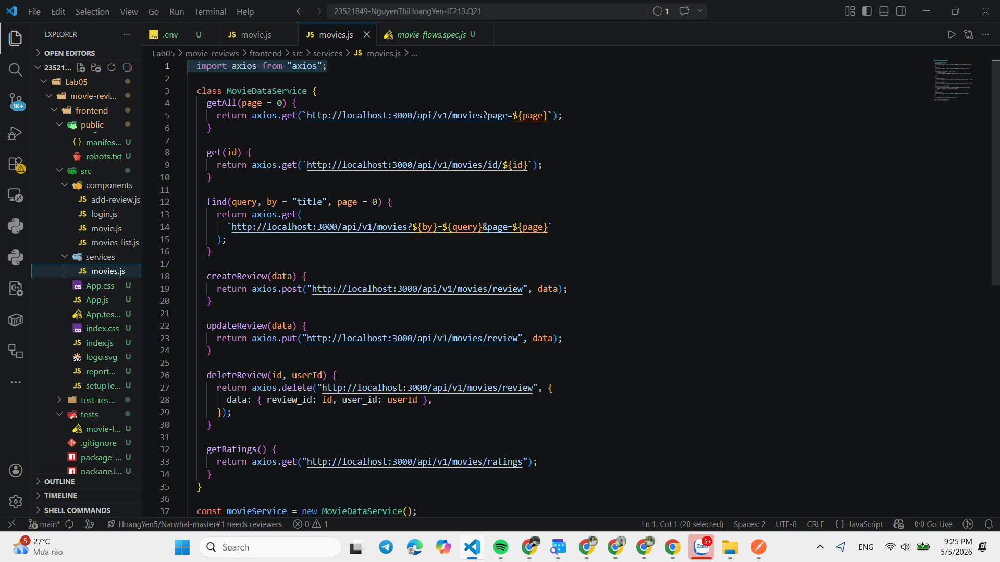
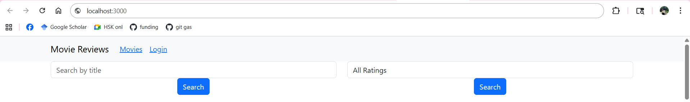
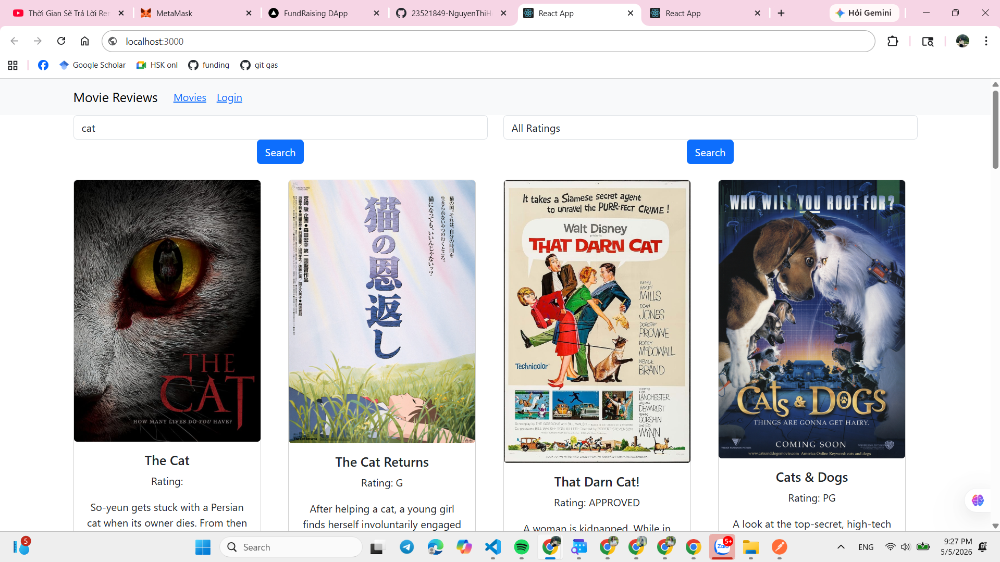
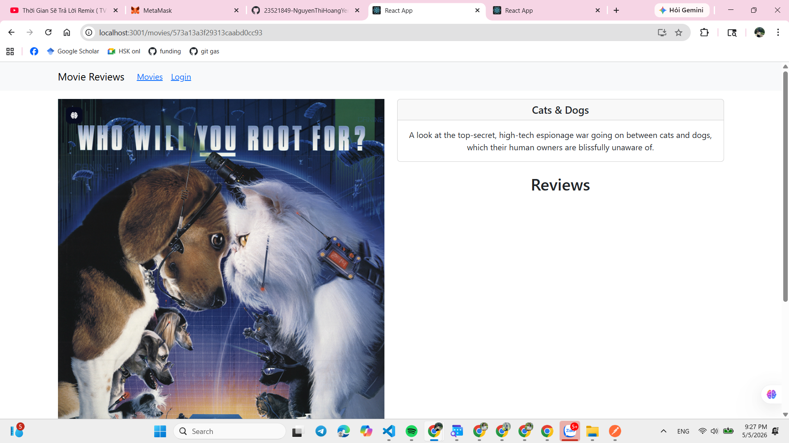
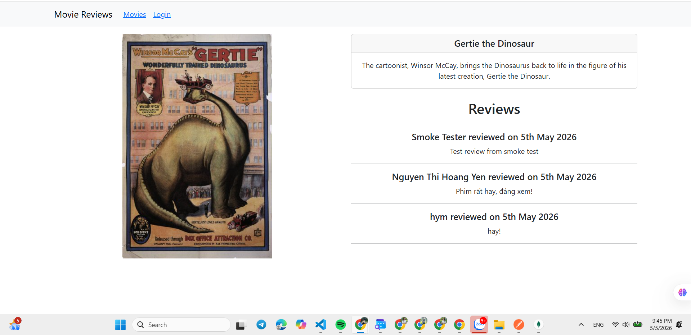
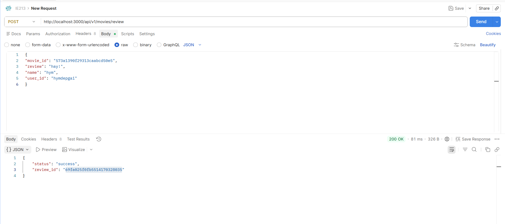

# LAB04 – Xây dựng Frontend với React.js

---
## Thông tin sinh viên
- Họ tên: Nguyễn Thị Hoàng Yến
- MSSV: 23521849
- Môn học: IE213.Q21 – Kỹ thuật phát triển hệ thống Web

## Mô tả bài LAB
- Xây dựng phần frontend cho ứng dụng Movie Reviews bằng ReactJS.
- Yêu cầu: tạo giao diện hiển thị danh sách phim, trang chi tiết phim (kèm review), chức năng thêm review và trang đăng nhập, sử dụng React Router để định tuyến và React-Bootstrap để xây dựng Navbar.

## Cấu trúc thư mục chính (Lab05/movie-reviews)
- `backend/` — mã nguồn server (Express) gồm `index.js`, `server.js`, thư mục `api/` (route, controllers) và `dao/` (truy cập MongoDB).
- `frontend/` — ứng dụng React (create-react-app) cho phần giao diện:
    - `package.json`: khai báo dependencies và các script (`start`, `build`, ...).
    - `public/`: chứa `index.html`, `manifest.json`, các tài nguyên tĩnh (hình ảnh, favicon).
    - `src/`:
        - `index.js`: entry point khởi tạo React app.
        - `App.js`: cấu hình `Routes`, `Navbar` và quản lý trạng thái `user` toàn cục.
        - `services/movies.js`: lớp `MovieDataService` dùng `axios` cho các gọi API tới backend.
        - `components/`:
            - `movies-list.js` — hiển thị danh sách phim và tìm kiếm.
            - `movie.js` — trang chi tiết phim, hiển thị thông tin và `reviews`.
            - `add-review.js` — form thêm / sửa review.
            - `login.js` — form đăng nhập đơn giản (lưu `user` vào state của `App`).
        - `public/` và `src` chứa các file CSS, assets, và file test (nếu có).

## Công cụ & thư viện

- React (create-react-app)
- react-router-dom (định tuyến)
- react-bootstrap, bootstrap (giao diện)
- Postman
- Visual Studio Code

## Bài 1: Kết nối tới Backend

#### 1.1 Cài đặt axios cho dự án
#### 1.2 Tạo lớp dịch vụ có tên MovieDataService
#### 1.3 Tạo các lời gọi tới backend
``

**Kết quả**

---

### Bài 2: Xây dựng MoviesList Component

#### 2.1 Tạo các biến trạng thái

Tạo thư mục `components` trong `src/` và tạo các file component:

- `movies-list.js`: hiển thị thông tin danh sách phim
- `movie.js`: hiển thị phim với các review
- `add-review.js`: hỗ trợ thêm review cho khách
- `login.js`: trang đăng nhập cho khách

#### 2.2 Tạo 2 phương thức retrieveMovies() và retrieve Ratings()

#### 2.3 Tạo 2 search form

**Kết quả**

#### 2.4 Hiển thị movie bằng Card

#### 2.5 Thực hiện 2 phương thức findByTitle() và findByRating()

**Kết quả**

---

### Bài 3: Hiển thị thông tin trong movie khi nhấn vào View Review
#### 3.1 Thiết lập mã nguồn cho component Movie
#### 3.2 Xây dựng mã nguồn cho phương thức getMovie()
#### 3.3 Trang trí phần JSX trả về

**Kết quả**

---

### Bài 4: Hiển thị danh sách review tương ứng
#### 4.1 Viết đoạn mã nguồn JSX cho phép hiển thị danh sách review
#### 4.2 Thêm vài review thông qua postman
#### 4.3 Điều chỉnh lại cách hiển thị giờ

**Kết quả**

