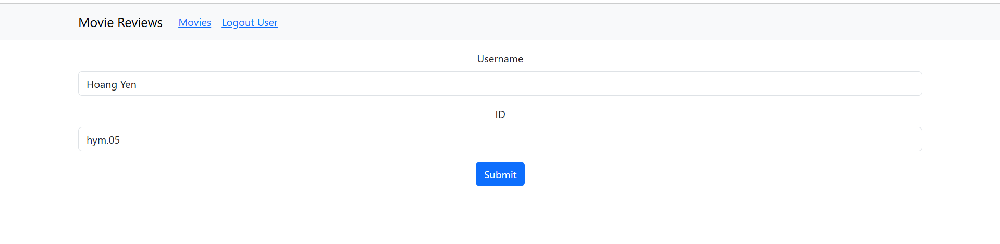
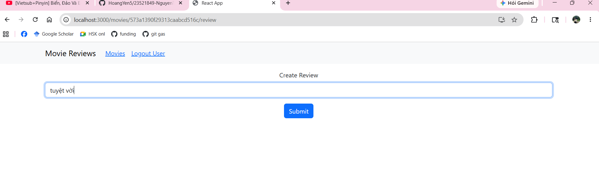
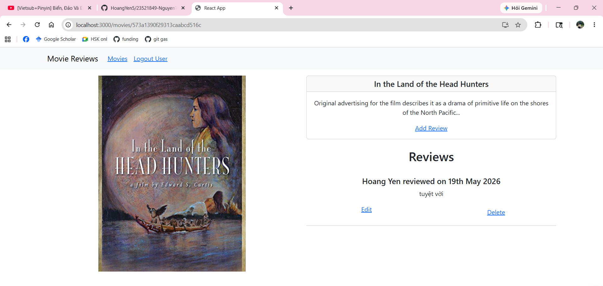
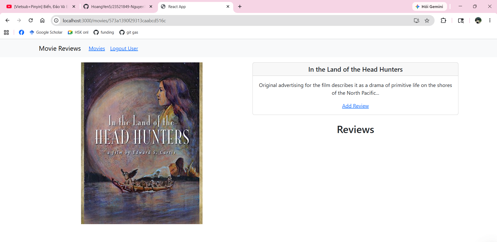
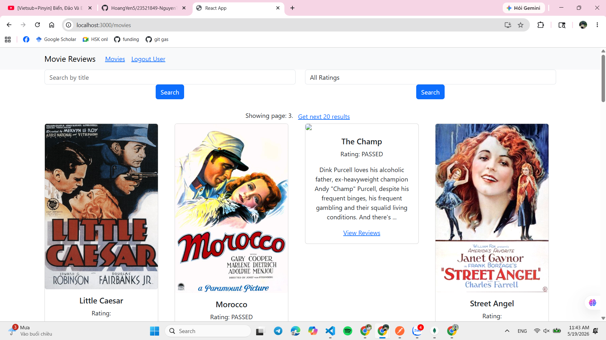
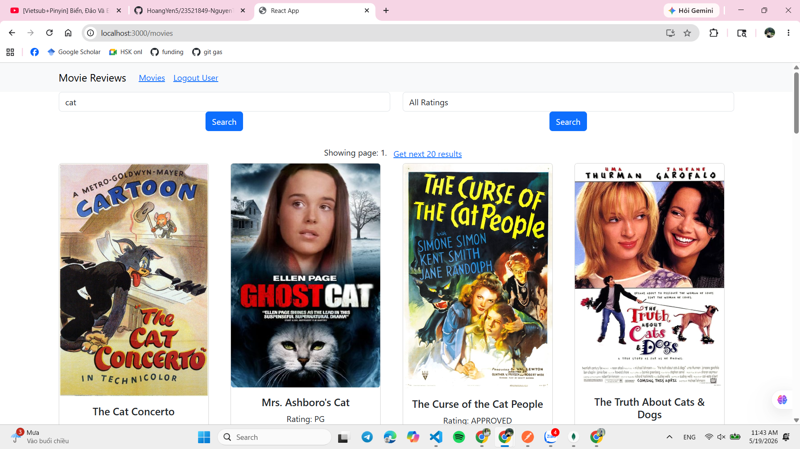
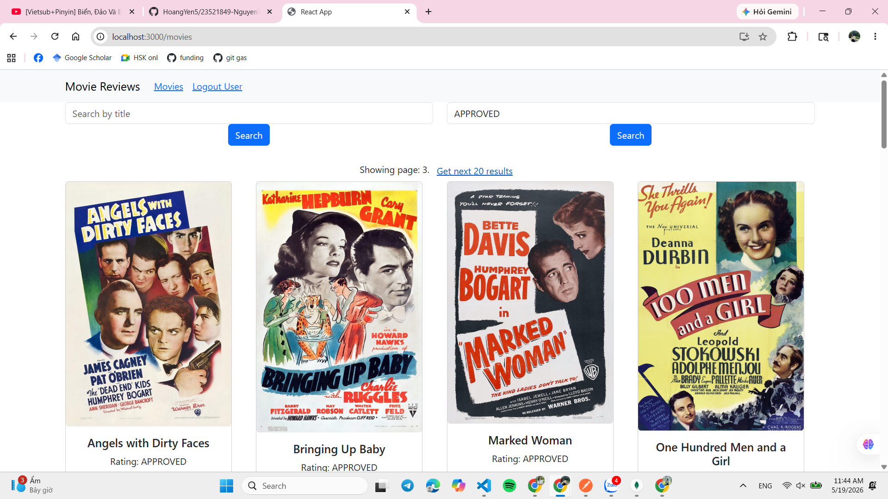

# LAB06 – Xây dựng Frontend với React.js

---
## Thông tin sinh viên
- Họ tên: Nguyễn Thị Hoàng Yến
- MSSV: 23521849
- Môn học: IE213.Q21 – Kỹ thuật phát triển hệ thống Web

## Mô tả bài LAB
- Xây dựng phần frontend cho ứng dụng Movie Reviews bằng React.js (create-react-app).
- Triển khai giao diện hiển thị danh sách phim, trang chi tiết phim (kèm review), chức năng thêm/sửa/xóa review, trang đăng nhập đơn giản, phân trang và tìm kiếm. Sử dụng `react-router-dom`, `react-bootstrap` và `axios` để gọi API tới backend.

## Cấu trúc chính (Lab06/movie-reviews)
- [movie-reviews/backend](movie-reviews/backend)
- [movie-reviews/frontend](movie-reviews/frontend)

- Một số file quan trọng phía frontend:
    - [movie-reviews/frontend/src/App.js](movie-reviews/frontend/src/App.js#L1) — cấu hình `Routes`, `Navbar` và quản lý `user`.
    - [movie-reviews/frontend/src/services/movies.js](movie-reviews/frontend/src/services/movies.js#L1) — `MovieDataService` (axios) gọi API: `getAll`, `get`, `find`, `createReview`, `updateReview`, `deleteReview`, `getRatings`.
    - [movie-reviews/frontend/src/components/movies-list.js](movie-reviews/frontend/src/components/movies-list.js#L1) — danh sách phim, tìm kiếm theo tiêu đề/rating, và phân trang.
    - [movie-reviews/frontend/src/components/movie.js](movie-reviews/frontend/src/components/movie.js#L1) — trang chi tiết phim, hiển thị reviews, cho phép edit/delete (nếu là user hiện tại).
    - [movie-reviews/frontend/src/components/add-review.js](movie-reviews/frontend/src/components/add-review.js#L1) — form thêm/sửa review.
    - [movie-reviews/frontend/src/components/login.js](movie-reviews/frontend/src/components/login.js#L1) — form login đơn giản (lưu user vào state của `App`).

## Công cụ & thư viện
- React (create-react-app)
- react-router-dom
- react-bootstrap, bootstrap
- axios
- Node.js, npm

## Các chức năng đã triển khai

- Đăng nhập đơn giản: `Login` lưu `user` (name, id) vào state của `App` và điều hướng về trang chính.
- Hiển thị danh sách phim (`MoviesList`) với:
    - Tìm kiếm theo tiêu đề và rating (`find()` trong `MovieDataService`).
    - Phân trang: hiển thị trang hiện tại và nút lấy trang tiếp theo (tham số page gửi tới API `getAll(page)`).
- Trang chi tiết phim (`Movie`): hiển thị thông tin phim, poster và danh sách `reviews`.
    - Nếu đang login, người dùng có thể `Add Review` (navigates to `/movies/:id/review`).
    - Người tạo review có thể `Edit` (navigate với state chứa review) hoặc `Delete` (gọi `deleteReview(review_id, user_id)`).
- Thêm / Sửa review (`AddReview`): gửi `createReview` hoặc `updateReview` tới backend, sau khi submit chuyển về trang chi tiết phim.

## API (đầu cuối được frontend gọi)
- `GET /api/v1/movies?page=<page>` — lấy danh sách phim (có phân trang).
- `GET /api/v1/movies/id/:id` — lấy thông tin chi tiết phim (kèm reviews).
- `GET /api/v1/movies?title=<q>&page=<p>` hoặc `?rated=<rating>&page=<p>` — tìm kiếm.
- `POST /api/v1/movies/review` — tạo review.
- `PUT /api/v1/movies/review` — cập nhật review.
- `DELETE /api/v1/movies/review` — xóa review (gửi body chứa `review_id` và `user_id`).

## Hướng dẫn chạy (tại thư mục `Lab06/movie-reviews`)

1. Chạy backend:

```powershell
cd "Lab06/movie-reviews/backend"
npm install
npm start
```

2. Chạy frontend:

```powershell
cd "Lab06/movie-reviews/frontend"
npm install
npm start
```

Lưu ý: backend mặc định lắng nghe `http://localhost:5000`, frontend gọi API tới địa chỉ này trong `services/movies.js`.

## Kết quả (ảnh minh họa)
- Bài 1: Login, Thêm review, Sửa review
    - 
    - 
    - 
- Bài 2: Xóa review
    - 
- Bài 3: Phân trang và tìm kiếm
    - 
    - 
    - 

---

Nếu bạn muốn, tôi có thể giúp:
- Thêm hướng dẫn cài đặt chi tiết cho Windows/WSL.
- Cam kết và push thay đổi lên nhánh git (nếu bạn muốn).
